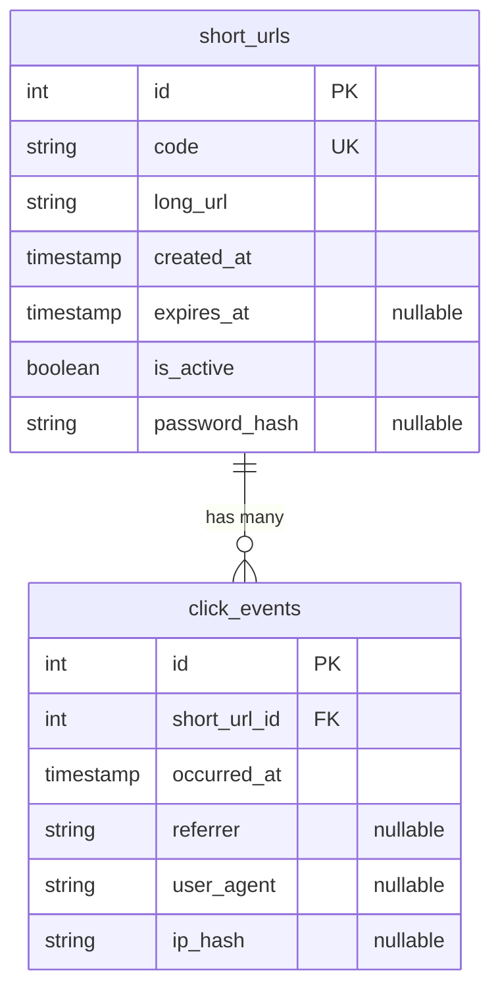

# Database Schema

PostgreSQL, managed via Prisma migrations (`prisma/migrations/`).

## ER diagram

## `short_urls`

| Column | Type | Notes |
|---|---|---|
| `id` | `SERIAL PK` | Internal identity, never exposed to clients. |
| `code` | `TEXT UNIQUE` | Short code or custom alias, 3-32 chars, `[A-Za-z0-9_-]`. Indexed via the unique constraint — this is the lookup key for every redirect. |
| `long_url` | `TEXT` | Validated `http(s)` URL, ≤2048 chars, at creation time. |
| `created_at` | `TIMESTAMP` | Defaults to `now()`. |
| `expires_at` | `TIMESTAMP NULL` | Optional. Checked, not enforced by deletion — an expired row still exists so its click history remains queryable via `/stats`. |
| `is_active` | `BOOLEAN` | Soft-delete flag. `false` after `DELETE /api/urls/:code`. |
| `password_hash` | `TEXT NULL` | bcrypt hash (cost 10) of an optional per-link password. `NULL` means the link isn't protected. Never sent to clients — the API only ever exposes a derived `hasPassword` boolean, and this column is deliberately excluded from the Redis cache entry too (see [architecture.md](architecture.md)). |

## `click_events`

| Column | Type | Notes |
|---|---|---|
| `id` | `SERIAL PK` | |
| `short_url_id` | `INTEGER FK → short_urls.id` | Indexed (`click_events_short_url_id_idx`) so `/stats` reads (count + recent events, ordered by time) never scan the whole table. |
| `occurred_at` | `TIMESTAMP` | Defaults to `now()`. |
| `referrer` | `TEXT NULL` | From the `Referer` request header, if present. |
| `user_agent` | `TEXT NULL` | From the `User-Agent` request header, if present. |
| `ip_hash` | `TEXT NULL` | SHA-256 of the client IP, truncated to 16 hex chars — enough to de-duplicate/rate-reason about traffic without storing raw IPs. |

## Design notes

- **Append-only `click_events`, no update/delete path.** Clicks are a log,
  not a mutable resource.
- **No cascade delete from `short_urls` to `click_events`.** The FK uses
  `ON DELETE RESTRICT` (Prisma's default) — a `short_urls` row can't be
  hard-deleted while click history references it, which is intentional: the
  only supported "delete" is the soft delete (`is_active = false`).
- **Unpaginated by default is not a concern here** — `GET /api/urls` and the
  recent-events list on `/stats` both take `limit`/`offset` query params
  (default `limit=20`, capped at 100), so this doesn't silently degrade as
  data grows.
